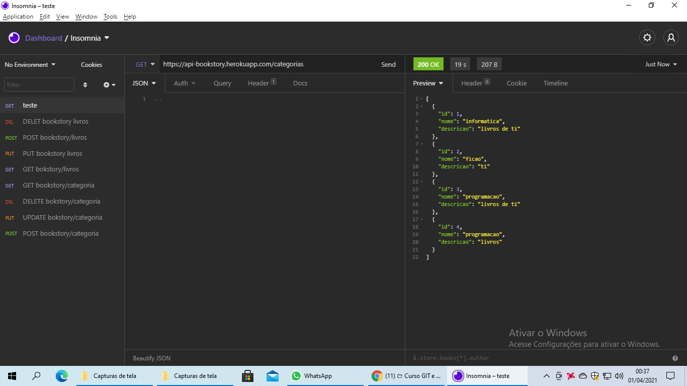
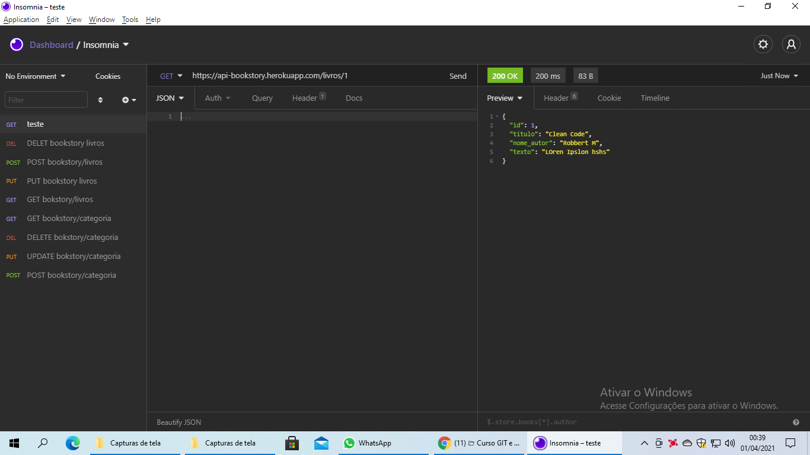
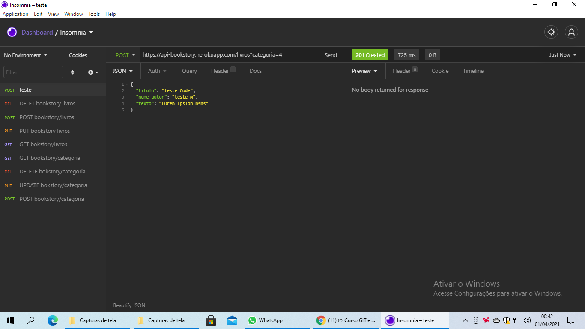
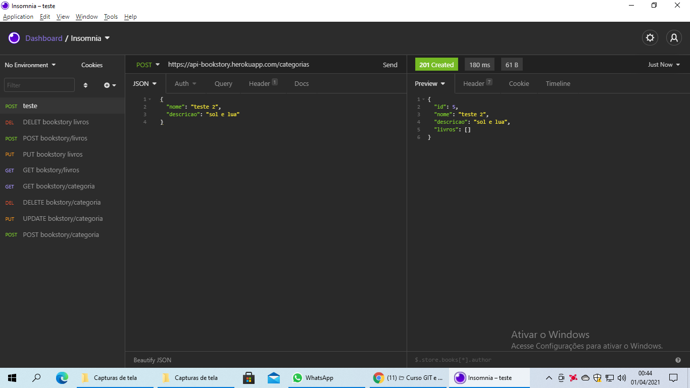
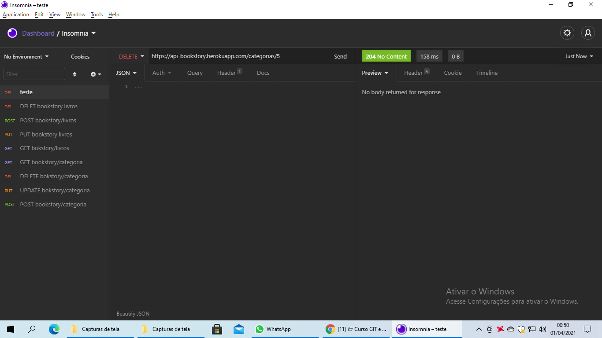

# CRUD-spring-boockstory

## configuração com Mysql 
* caso de erro de  fuso horario face os passos abaixo 
* - abra o console do Mysql.
* - digite SET @@global.time_zone = '+3:00';
* - pronto ira funcionar o erro de fuso horario no spring
* - caso for da um clone mude o aplication.properties de PROD para DEV 

# requisições 

* $ GET =  https://api-bookstory.herokuapp.com/categorias isto listará todas as categorias
* 
* $ GET =  https://api-bookstory.herokuapp.com/livros/ apos o / selecione um id que le listara os livros
* 
* $ PUT = basta colocar a url mas o id da categoria ou livro que quer editar e depiis escrever em json
* 
* $ POST =  https://api-bookstory.herokuapp.com/livros?categoria=4 esse e um expmlo para adicionar um livro o id e da categoria que vai ser adicionado
* 
* $ POST = para cadastrar uma categoria e so colocar a url com metodos POST e colocar as informações no json
* 
* $ DELETE = para deletar uma categoria e so passar o id da categoria exmplo  https://api-bookstory.herokuapp.com/categorias/1 / serve para livros tambem
* 
